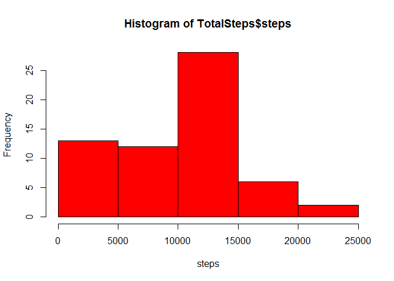
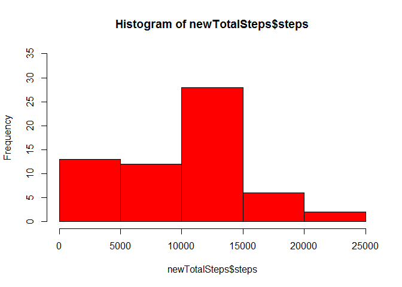

# Reproducible Research: Peer Assessment 1
Niteen Autade  

We will use the dplyr and the magrittr package for this assignment.

```r
library(dplyr);library(magrittr);library(knitr);library(lattice)
```

## Loading and preprocessing the data

```r
data<-read.csv(file="activity.csv")
data$date<-as.Date(data$date,format="%Y-%m-%d")
```


## What is mean total number of steps taken per day?

```r
TotalSteps<-data %>%
    group_by(date) %>%
    summarise(steps=sum(steps,na.rm=TRUE)) 

hist(TotalSteps$steps,col = "red",xlab="steps")
```

 

Mean of Total number of Steps: **9354.23**

Median of Total number of Steps: **10395**


## What is the average daily activity pattern?

```r
steps.interval<-data %>%
    group_by(interval) %>%
    summarise(steps=mean(steps,na.rm=TRUE))
plot(steps~interval,data=steps.interval,type="l")
```

 

```r
steps.interval[steps.interval$steps==max(steps.interval[,2]),]$interval
```

```
## [1] 835
```

## Imputing missing values
Total number of missing values in the dataset

```r
sum(is.na(data$steps))
```

```
## [1] 2304
```

Devise a strategy for filling in all of the missing values in the dataset. The strategy does not need to be sophisticated. For example, you could use the mean/median for that day, or the mean for that 5-minute interval, etc.


```r
#I will use the mean for that day to fill the NA's
fillNa<-function(data){
for(i in 1:nrow(data)){
  if(is.na(data$steps[i])==TRUE)
  { reqdate<-data$date[i]
    data$steps[i]<-TotalSteps[TotalSteps$date==reqdate,2]}
}
  data$steps<-as.numeric(data$steps)
  return(data)}
```

Create a new dataset that is equal to the original dataset but with the missing data filled in.

```r
newdata<-data
newdata<-fillNa(newdata)

newTotalSteps<- newdata %>%
  group_by(date) %>%
  summarise(steps=sum(steps))
```

Make a histogram of the total number of steps taken each day and Calculate and report the mean and median total number of steps taken per day. Do these values differ from the estimates from the first part of the assignment? What is the impact of imputing missing data on the estimates of the total daily number of steps?


```r
hist(newTotalSteps$steps,col="red",ylim=c(0,35))
```

 

Mean of Total number of Steps: **9354.23**

Median of Total number of Steps: **10395**

After replacing the NA's ,the mean and median obtained remained same as that in the first part.


## Are there differences in activity patterns between weekdays and weekends?

Create a new factor variable in the dataset with two levels – “weekday” and “weekend” indicating whether a given date is a weekday or weekend day.

```r
for(i in 1:nrow(newdata))
{if(weekdays(newdata$date[i]) %in% c("Saturday","Sunday"))
{newdata$daytype[i]="weekend"}
else {newdata$daytype[i]="weekday"}
}
```

Make a panel plot containing a time series plot (i.e. type = "l") of the 5-minute interval (x-axis) and the average number of steps taken, averaged across all weekday days or weekend days (y-axis). See the README file in the GitHub repository to see an example of what this plot should look like using simulated data.


```r
stepsByDay <- aggregate(steps ~ interval + daytype, data = newdata, mean)
names(stepsByDay) <- c("interval", "daytype", "steps")
xyplot(steps ~ interval | daytype, stepsByDay, type = "l", layout = c(1, 2), 
    xlab = "Interval", ylab = "Number of steps")
```

 
